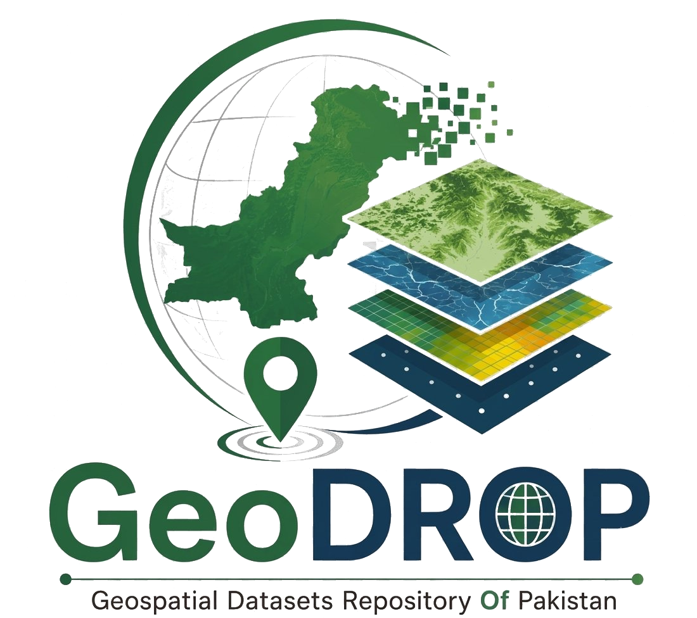
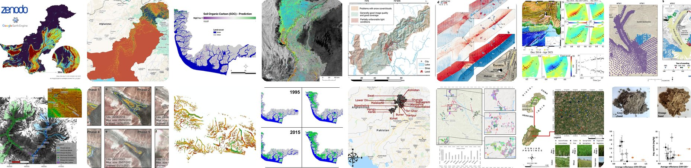
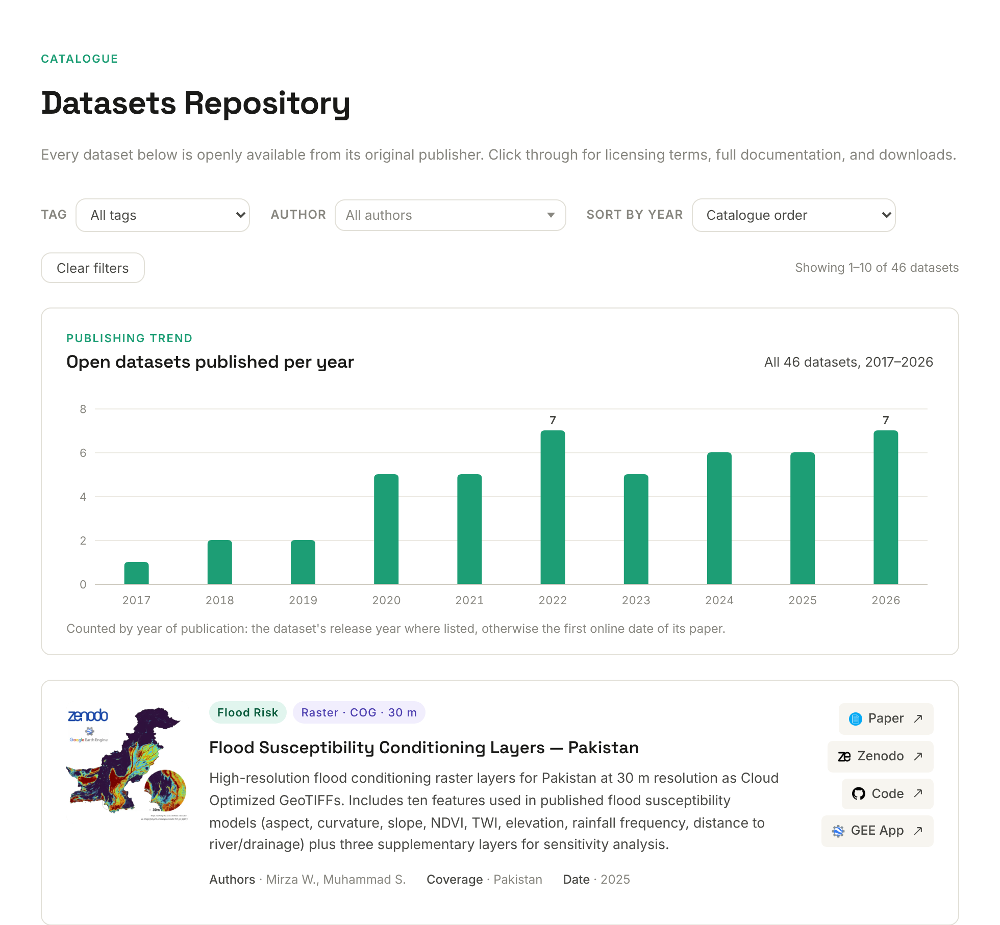

<div align="center">

<a href="https://geoscapeanalyticslab.github.io/GeoDROP/">
  
</a>

# GeoDROP

### Geospatial Datasets Repository of Pakistan

**Open, peer-reviewed geospatial datasets about Pakistan, gathered in one searchable place.**

[](https://geoscapeanalyticslab.github.io/GeoDROP/)
[](https://geoscapeanalyticslab.github.io/GeoDROP/#datasets)
[](https://geoscapeanalyticslab.github.io/)
<br>
[](https://github.com/geoscapeanalyticslab/GeoDROP/actions/workflows/static.yml)

[**Browse the datasets →**](https://geoscapeanalyticslab.github.io/GeoDROP/) &nbsp;·&nbsp;
[Suggest a dataset](https://github.com/geoscapeanalyticslab/GeoDROP/issues/new?template=suggest-a-dataset.yml) &nbsp;·&nbsp;
[GeoScape Analytics Lab](https://geoscapeanalyticslab.github.io/)

<br>



</div>

---

## Why GeoDROP?

Good geospatial data about Pakistan exists, but it is scattered across journal supplements, Zenodo records, Earth Engine apps and university portals. Finding it usually means a long literature search before any real work can begin.

GeoDROP brings these datasets together. Every entry links straight to the **original paper** and the **place to download the data**, so you can go from question to data in a few clicks. It is curated by the [GeoScape Analytics Lab (GSAL)](https://geoscapeanalyticslab.github.io/) at the Institute of Geography, University of the Punjab, Lahore.

## What you can do on the site



| Feature | How it works |
|---|---|
| 🏷️ **Filter by theme** | Pick a tag such as *Cryosphere*, *Seismotectonics* or *Agriculture*. |
| 👩‍🔬 **Filter by author** | Type a name and choose from the suggestions to see one researcher's datasets. |
| 📈 **See the publishing trend** | A chart shows how many open datasets were published each year, and redraws for whatever tag or author you select. |
| 📅 **Sort by year** | Oldest-first or newest-first. |
| 🔗 **Go straight to the source** | Each card links to the paper and to Zenodo, Figshare, a data portal, code or a Google Earth Engine app. |

## What's inside

46 datasets (as of October 2026) from 149 authors, published between 2017 and 2026. The live site always has the current count.

| Theme | Datasets | Examples |
|---|:---:|---|
| 🧊 Glaciers & cryosphere | 10 | Shisper glacier surge, Baltoro supraglacial lakes, Hunza glacier height change, Ghizer GLOF simulations |
| 🌋 Earthquakes, landslides & geology | 9 | 2013 Balochistan earthquake deformation, Makran megathrust, Nanga Parbat velocities, Kaghan landslide inventory |
| 🌳 Forests, mangroves & land cover | 8 | Western Himalaya canopy height (WHiCH), mangrove cover 1990–2020, Indus Delta mangrove biomass |
| 🌾 Agriculture & soils | 8 | National soil erosion, wheat area maps of Punjab, crop spectral library (CROPSPECPK), desertification |
| 🌊 Floods & coastal hazards | 7 | 2022 flood extents and masks, flood susceptibility layers, Karachi shoreline change, Makran 1945 tsunami DEM |
| 💧 Water, air & biodiversity | 4 | Groundwater quality, arsenic in the Upper Indus Plain, brick kilns of the IGP, anuran habitat suitability |

Every dataset has a paper link. 27 are hosted on Zenodo, 6 come with a Google Earth Engine app, and the rest live on Figshare, institutional data portals or the journal's own site.

## What makes the list

A dataset is included when it is:

1. **Openly available** for download from its publisher or repository,
2. **Published with a peer-reviewed paper** in a recognised journal, and
3. **Specific to Pakistan** or a region within it. Global products are left out.

## Suggest a dataset

Know an open dataset that should be here? Two ways to send it:

- **[Open a dataset suggestion](https://github.com/geoscapeanalyticslab/GeoDROP/issues/new?template=suggest-a-dataset.yml)** on GitHub. The form asks for everything we need.
- **Email** [geoscapeanalyticslab@gmail.com](mailto:geoscapeanalyticslab@gmail.com) with the dataset name and a short description, coverage area and time period, data format, download link, and the paper.

## For maintainers

<details>
<summary><b>Adding a dataset card</b></summary>

<br>

The whole site is one file, `index.html`. Each dataset is a `dataset-card` inside `<div class="datasets-grid">`. Copy an existing card and change:

```html
<div class="dataset-card" data-published="2025">
  
  <div class="dataset-main">
    <div class="dataset-tags">
      <span class="tag tag-cat">Cryosphere</span>
      <span class="tag tag-res">Raster · GeoTIFF · 30 m</span>
    </div>
    <div class="dataset-name">…</div>
    <p class="dataset-desc">…</p>
    <div class="dataset-meta">
      <div class="meta-item"><strong>Authors</strong> · Surname A., Surname B.</div>
      <div class="meta-item"><strong>Coverage</strong> · Pakistan</div>
      <div class="meta-item"><strong>Date</strong> · 2000–2020</div>
    </div>
  </div>
  <div class="dataset-action">…Paper / Zenodo / Code / GEE App buttons…</div>
</div>
```

- **The first `tag` (`tag-cat`) is the theme** shown in the Tag filter. The image is a square preview.
- **Tags, authors and the trend chart update themselves.** No list to edit by hand.
- **Write authors as `Surname I.`**, comma-separated. The author filter matches these exactly.
- **`data-published`** is the year the dataset was published; the chart counts it. A `Date Published` line on the card works too.
- **`Date`** is the time span of the data itself and is not used by the chart.
- Not ready yet (for example, no preview image)? Wrap the card in `<!-- … -->` and it stays off the site.

</details>

<details>
<summary><b>Running the site locally</b></summary>

<br>

No build step and no dependencies. From the repository folder:

```bash
python -m http.server 8000
```

Then open <http://localhost:8000>. Every push to `main` is deployed to GitHub Pages by `.github/workflows/static.yml`.

</details>

<details>
<summary><b>Repository layout</b></summary>

<br>

```
index.html                 the entire site: markup, styles and scripts
images/                    dataset preview images (vN.png) and button icons (logos/)
67.png                     GeoDROP logo
favicon_rounded.png        browser tab icon
.github/workflows/         GitHub Pages deployment
.github/ISSUE_TEMPLATE/    the "Suggest a dataset" form
.github/readme/            images used in this README
```

</details>

## Citing

**Using a dataset?** Please cite its original paper, linked on its card. The credit belongs to the authors. GeoDROP only points the way.

**Referring to GeoDROP itself?**

> GeoScape Analytics Lab (2026). *GeoDROP: Geospatial Datasets Repository of Pakistan.* https://geoscapeanalyticslab.github.io/GeoDROP/

## Licence and credit

All datasets listed belong to their respective authors and remain under their original licences. GeoDROP does not re-host data. It curates links and metadata.

---

<div align="center">

**Curated by [GeoScape Analytics Lab (GSAL)](https://geoscapeanalyticslab.github.io/)** · Institute of Geography, University of the Punjab, Lahore

[Website](https://geoscapeanalyticslab.github.io/) ·
[LinkedIn](https://www.linkedin.com/company/geoscape-analytics-lab-gsal/) ·
[Facebook](https://www.facebook.com/profile.php?id=61589758893140) ·
[Email](mailto:geoscapeanalyticslab@gmail.com)

🇵🇰 *Made in Pakistan*

</div>
